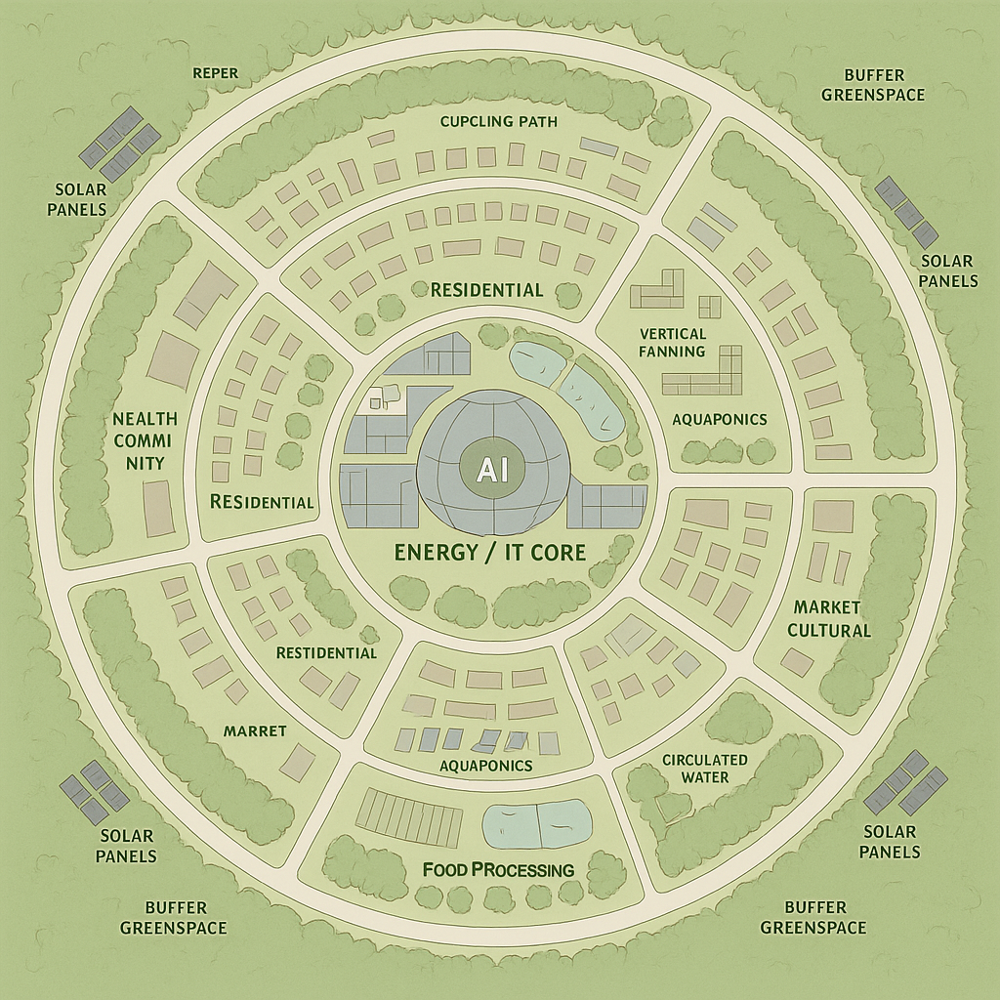
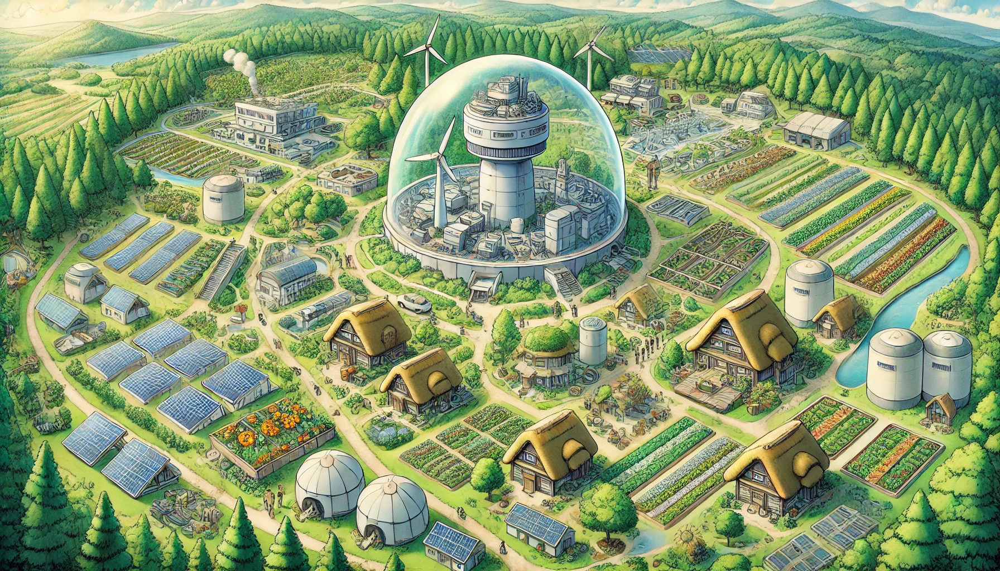
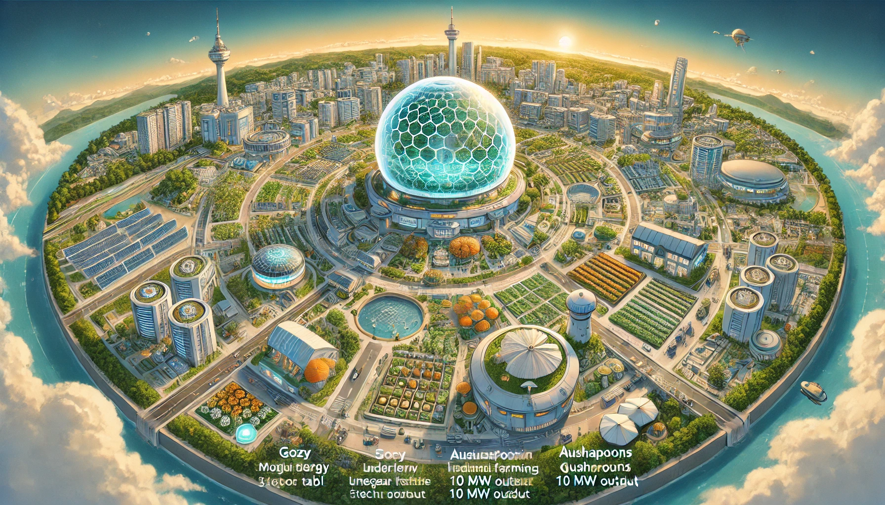

## 🌍 **Nucleo — A City at the Core of the Future**

**英語説明文：**

> **Nucleo** is a next-generation micro-city designed around the principles of self-sufficiency, advanced energy, and human-centered technology.
> At its heart lies a compact 10MW micro nuclear reactor—clean, secure, and sustainable.
>
> Powered by this core, Nucleo fosters a vibrant ecosystem of AI-driven governance, high-tech industry, and regenerative agriculture.
> Its community thrives through mutual support, where children grow to care for elders, and innovation grows hand-in-hand with nature.
>
> Nucleo isn’t just a city. It’s a living prototype of how humanity can live in balance—with technology, with nature, and with each other.

---

**日本語訳：**

> **Nucleo（ヌクレオ）** は、自給自足・先進エネルギー・人間中心のテクノロジーを軸に設計された次世代型マイクロシティです。
> 中心には、高度に安全で持続可能な**10MW級小型原子炉**が静かに鼓動を打ち、街全体を支えています。
>
> そのエネルギーを活かし、Nucleoは生成AIによる自治運営、ハイテク産業、再生型農業が共存する**共創型都市エコシステム**を築いています。
> ここでは子どもたちが学び、やがて高齢者を支えるよう育ち、テクノロジーと自然が調和の中で共に進化していきます。
>
> Nucleoは単なる都市ではありません。**人類が「共に生きる」未来の姿を示す、生きたプロトタイプ**です。

---

  
  
  

[今後の街を発展させるシナリオ](./micro_reactor_city_design.md)  
[街を発展させるイメージゲーム](./game.md)

