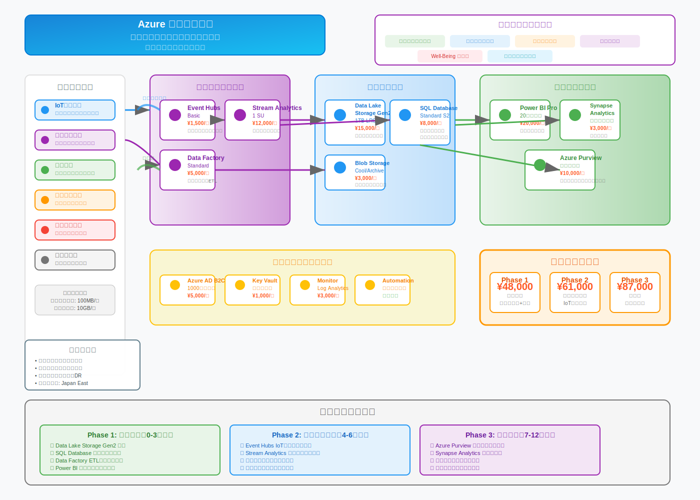

# マイクロ炉自給自足型モデル都市 IT共通基盤カテゴリー体系

## 1. データ基盤層（Data Foundation Layer）

### 1.1 統合データプラットフォーム
- **都市データレイク**: 全分野のデータを統一フォーマットで蓄積
- **リアルタイムデータストリーミング**: IoTセンサー、システムログの即時処理
- **データウェアハウス**: 分析用データの構造化・最適化
- **データカタログ**: データの所在・形式・権限を一元管理

### 1.2 マスターデータ管理
- **住民情報基盤**: 個人ID、世帯情報、権限管理
- **施設・設備情報**: 建物、インフラ、設備の一元管理
- **地理空間情報**: GIS基盤、3D都市モデル、座標系統一
- **組織・職務情報**: 行政組織、企業、役職の階層管理

[]

## 2. 認証・認可基盤層（Identity & Access Management）

### 2.1 統合認証システム
- **シングルサインオン（SSO）**: 全システム共通ログイン
- **多要素認証（MFA）**: セキュリティレベル別認証
- **デジタルアイデンティティ**: 住民番号ベースの統一ID
- **ゲストアクセス管理**: 来訪者・業者向け一時認証

### 2.2 権限管理システム
- **役割ベースアクセス制御（RBAC）**: 職務・立場別権限設定
- **属性ベースアクセス制御（ABAC）**: 状況・条件別権限制御
- **動的権限管理**: 緊急時・特別業務での権限変更
- **監査ログ**: アクセス履歴の完全記録

## 3. 通信・ネットワーク基盤層（Communication Infrastructure）

### 3.1 ネットワークインフラ
- **5G/6Gプライベートネットワーク**: 高速・低遅延通信
- **メッシュネットワーク**: 災害時の通信継続性確保
- **エッジコンピューティング**: 分散処理による高速化
- **SD-WAN**: ソフトウェア定義による柔軟なネットワーク

### 3.2 API基盤
- **統合APIゲートウェイ**: 全システム間の標準化された連携
- **マイクロサービス基盤**: 機能分割による柔軟性確保
- **イベント駆動アーキテクチャ**: リアルタイム連携基盤
- **API管理・監視**: バージョン管理、性能監視、セキュリティ

## 4. AI・機械学習基盤層（AI/ML Platform）

### 4.1 AI開発・運用プラットフォーム
- **MLOpsプラットフォーム**: モデル開発から運用まで
- **AutoML基盤**: 非専門家でもAI活用可能
- **モデル管理**: バージョン管理、性能監視、更新
- **推論エンジン**: リアルタイム・バッチ処理対応

### 4.2 都市特化AI機能
- **住民行動予測**: 交通、消費、イベント参加予測
- **エネルギー最適化**: 需給予測・自動制御
- **異常検知**: インフラ、セキュリティ、健康異常
- **意思決定支援**: 政策効果予測、資源配分最適化

## 5. IoT・センサー基盤層（IoT Infrastructure）

### 5.1 センサーネットワーク
- **環境センサー**: 気温、湿度、大気質、騒音
- **インフラセンサー**: 電力、水道、交通、建物状態
- **セキュリティセンサー**: 監視カメラ、人感、入退室
- **農業センサー**: 土壌、作物、気象、病害虫

### 5.2 デバイス管理
- **IoTプラットフォーム**: デバイス登録・管理・監視
- **OTA更新**: 遠隔でのファームウェア更新
- **エッジ処理**: センサーデータの前処理・フィルタリング
- **プロトコル統一**: 多様なIoTデバイスの標準化

## 6. セキュリティ基盤層（Security Foundation）

### 6.1 サイバーセキュリティ
- **ゼロトラストアーキテクチャ**: 全通信の検証・暗号化
- **SIEM/SOAR**: セキュリティ監視・自動対応
- **脅威インテリジェンス**: 最新脅威情報の自動取得
- **インシデント対応**: 自動隔離・復旧システム

### 6.2 プライバシー保護
- **データ匿名化**: 個人情報の自動マスキング
- **暗号化基盤**: データ保管・通信の暗号化
- **同意管理**: 住民のデータ利用同意管理
- **GDPR/個人情報保護**: 法規制への自動対応

## 7. アプリケーション基盤層（Application Platform）

### 7.1 開発・運用基盤
- **コンテナオーケストレーション**: Kubernetes基盤
- **CI/CD パイプライン**: 自動テスト・デプロイ
- **サーバーレス基盤**: イベント駆動型処理
- **クラウドネイティブ**: スケーラブルなアプリ基盤

### 7.2 共通機能サービス
- **通知基盤**: メール、SMS、プッシュ通知の統一管理
- **決済基盤**: 地域通貨、電子決済の統合
- **予約システム**: 施設、サービス予約の共通化
- **フォーム作成**: 申請・アンケートの動的生成

## 8. ユーザーインターフェース基盤層（UI/UX Platform）

### 8.1 マルチチャネル対応
- **レスポンシブデザイン**: PC、タブレット、スマホ対応
- **Progressive Web App**: アプリライクなWeb体験
- **音声インターフェース**: AIアシスタント連携
- **AR/VR対応**: 拡張現実・仮想現実インターフェース

### 8.2 アクセシビリティ
- **多言語対応**: 自動翻訳・多言語UI
- **高齢者対応**: 大きな文字、音声読み上げ
- **障害者対応**: スクリーンリーダー、音声操作
- **デジタルデバイド対策**: 操作支援、代行サービス

## 9. 統合・オーケストレーション基盤層（Integration & Orchestration）

### 9.1 システム間連携
- **Enterprise Service Bus**: システム間メッセージング
- **ワークフロー エンジン**: 業務プロセスの自動化
- **データ同期**: リアルタイム・バッチでのデータ連携
- **レガシー連携**: 既存システムとの橋渡し

### 9.2 ビジネスプロセス管理
- **BPM（Business Process Management）**: 業務フロー可視化・最適化
- **RPA（Robotic Process Automation）**: 定型作業の自動化
- **意思決定エンジン**: ルールベースの自動判定
- **承認ワークフロー**: 電子決裁システム

## 10. 運用・監視基盤層（Operations & Monitoring）

### 10.1 システム監視
- **統合監視プラットフォーム**: 全システムの一元監視
- **ログ管理**: 集約・検索・分析基盤
- **パフォーマンス監視**: 応答時間、スループット測定
- **可用性監視**: SLA管理、障害検知・通知

### 10.2 運用自動化
- **Infrastructure as Code**: インフラの自動構築
- **自動復旧**: 障害の自動検知・復旧
- **容量管理**: リソース使用量の予測・自動拡張
- **バックアップ・DR**: 災害復旧の自動化

## 新規IT・SaaS統合のための戦略

### 即座に統合可能な条件
1. **標準API対応**: REST/GraphQL API提供
2. **認証連携**: OAuth 2.0/SAML対応
3. **Webhook対応**: リアルタイム連携可能
4. **データエクスポート**: 標準フォーマット出力

### 段階的統合プロセス
1. **評価段階**: セキュリティ・性能・互換性評価
2. **PoC段階**: 小規模での動作検証
3. **統合段階**: 既存システムとの連携構築
4. **運用段階**: 監視・保守体制への組み込み

### 将来技術への対応
- **量子コンピューティング**: 暗号化・最適化問題対応
- **6G通信**: 超高速・超低遅延通信基盤
- **ブロックチェーン**: 分散台帳・スマートコントラクト
- **メタバース**: 仮想空間での住民サービス

## 投資優先順位

### Phase 1（2025-2027年）: 基盤構築
1. データ基盤層
2. 認証・認可基盤層
3. 通信・ネットワーク基盤層

### Phase 2（2028-2032年）: 知能化
1. AI・機械学習基盤層
2. IoT・センサー基盤層
3. セキュリティ基盤層

### Phase 3（2033-2040年）: 高度化
1. アプリケーション基盤層
2. 統合・オーケストレーション基盤層
3. 運用・監視基盤層

この共通基盤により、新しいIT・SaaSが登場した際も、標準化されたインターフェースを通じて迅速に統合でき、都市全体のデジタル化と最適化を継続的に進化させることが可能になります。
