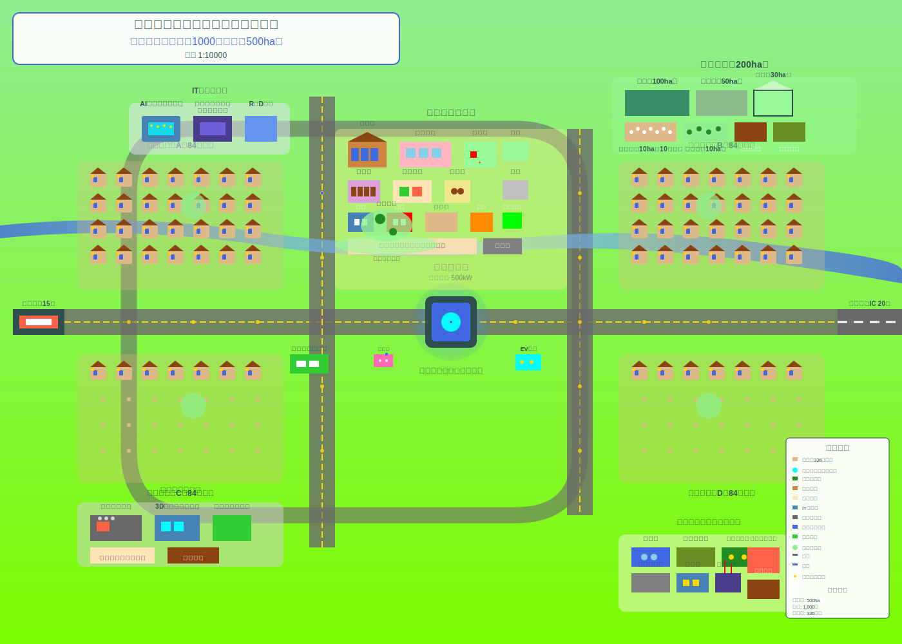
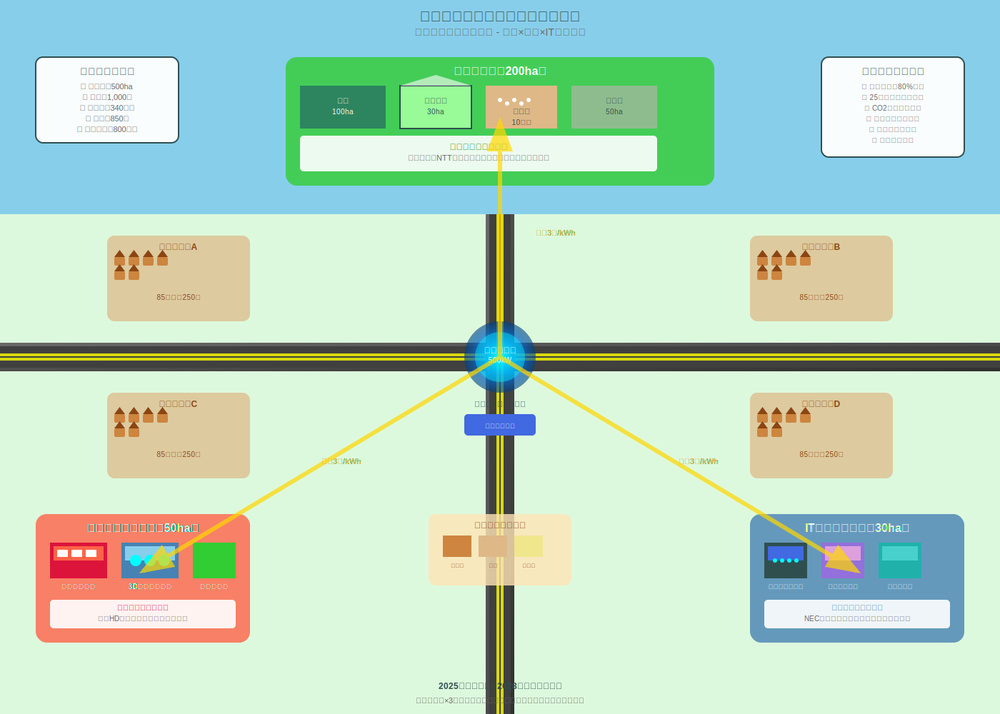

# マイクロ炉自給自足型モデル都市 基本設計書

## 1. プロジェクト概要

### 1.1 プロジェクトビジョン
**「25年サイクル永続型自給自足都市モデルの構築」**

労働人口減少社会における持続可能な地域コミュニティのプロトタイプとして、小規模自治区の自給自足モデルを確立し、将来的に複数の自治区を組み合わせた広域都市形成の基盤となる革新的な都市を建設する。

### 1.2 基本理念
- **Well-Being重視**: 住民の身体的・精神的・社会的健康を最優先とした都市設計
- **25年サイクル持続性**: マイクロ炉の運用期間に合わせた計画的な都市更新システム
- **完全内製化**: 外部依存を最小限に抑えた自律的経済圏の構築
- **技術革新拠点**: AI・IoT技術を活用したスマートシティのショーケース

### 1.3 開発スケジュール
- **2025-2030年**: 基本インフラ建設・法規制整備
- **2030-2035年**: 住民移住・産業立ち上げ
- **2035-2040年**: 完全稼働・モデル確立
- **2040年-**: 運用開始・他地域展開

## 2. 都市規模・人口計画

### 2.1 基本スペック
- **電力供給**: 三菱重工マイクロ炉（500kW）×1基
- **目標人口**: 800-1,000人（約300-350世帯）
- **敷地面積**: 約500ha（5km²）
- **人口密度**: 約200人/km²（低密度型）

### 2.2 人口構成


```
■ 年齢構成（目標）
- 0-14歳: 15% (120-150人) - 子供・教育世代
- 15-64歳: 70% (560-700人) - 労働世代
- 65歳以上: 15% (120-150人) - 高齢者・指導者世代

■ 職業構成
- 農業従事者: 25% (200-250人)
- 製造・加工業: 20% (160-200人)
- IT・AI関連: 15% (120-150人)
- 公共サービス: 15% (120-150人)
- 商業・サービス: 10% (80-100人)
- 教育・医療・福祉: 10% (80-100人)
- その他: 5% (40-50人)
```

## 3. エネルギーシステム設計


### 3.1 マイクロ炉中央システム
**設置場所**: 都市中心部地下15m
- **電力出力**: 500kW（24時間安定供給）
- **熱出力**: 1MW（地域暖房・産業利用）
- **運用期間**: 25年間（燃料交換不要）
- **安全システム**: 自然冷却、地下設置、多重防護

### 3.2 エネルギー配分計画
```
■ 電力配分（500kW）
- 住宅用: 200kW (40%) - 約300-350世帯
- 産業用: 150kW (30%) - 農業・製造業・IT
- 公共施設: 100kW (20%) - 学校・病院・行政
- インフラ: 50kW (10%) - 上下水道・照明・通信

■ 熱利用（1MW）
- 地域暖房: 400kW (40%) - 全建物暖房
- 農業施設: 300kW (30%) - 温室・乾燥施設
- 産業プロセス: 200kW (20%) - 食品加工
- 温水供給: 100kW (10%) - 全世帯給湯
```

### 3.3 補完エネルギーシステム
- **太陽光発電**: 50kW（屋根設置型）
- **小型風力**: 20kW（街路灯一体型）
- **バイオガス**: 農業廃棄物活用
- **蓄電システム**: リチウムイオン電池 500kWh

## 4. 都市レイアウト・ゾーニング



### 4.1 中央エネルギー区域
- **マイクロ炉施設**: 地下設置（直径50m、深度15m）
- **エネルギー管理センター**: AI制御システム
- **緊急時指揮所**: 災害対応拠点

### 4.2 住宅区域（4エリア×75-90世帯）


[住民が幸せな住居](./doc/residential_design.md)  

- **戸建て住宅**: 太陽光パネル設置、家庭菜園付き
- **集合住宅**: 高齢者・単身者向け
- **住宅仕様**: 高断熱、地熱利用、スマートホーム

### 4.3 産業区域



[産業区域](./doc/nuclear_city_investment_strategy.md)  

```
■ 農業エリア（200ha）
- 水田: 100ha（年間500トン米生産）
- 畑作地: 50ha（野菜・豆類・芋類）
- 温室施設: 30ha（年間通作、高付加価値作物）
- 養鶏場: 10ha（年間10万羽、卵・肉生産）
- 果樹園: 10ha（地域特産果物）

■ 製造・加工エリア（50ha）
- 食品加工工場: 米粉・惣菜・冷凍食品
- 農産物直売・流通センター
- 3Dプリンティング工場: 建材・部品製造
- リサイクル施設: 廃棄物処理・再資源化

■ IT・研究エリア（30ha）
- AIデータセンター: マイクロ炉電力活用
- スマートシティ管理センター
- 研究開発施設: 農業IoT・都市AI
- サテライトオフィス: 都市部企業連携
```

### 4.4 公共・商業区域（20ha）


[都市を支える公共施設](./doc/core_zone_master_design.md)  
[都市を支える公共KPI](./doc/public_facilities_kpi_manifesto_2040.md)  

- **行政機関**: 市役所、警察、消防
- **教育施設**: 小中学校、図書館、研修センター
- **医療・福祉**: 診療所、デイサービス、薬局
- **商業施設**: スーパー、レストラン、カフェ
- **文化・スポーツ**: 公民館、体育館、公園

## 5. インフラシステム

### 5.1 上下水道システム
- **給水**: 地下水・河川水活用、AI制御浄水場
- **下水処理**: バイオガス発生型処理施設
- **雨水利用**: 農業用水・非飲用水確保
- **中水道**: 処理水の農業・工業利用

### 5.2 通信・ITインフラ


[市都市を支えるインフラ](./doc/smart_city_it_infrastructure.md)  

- **5G/6Gネットワーク**: 全域カバー
- **光ファイバー**: 各建物直結
- **IoTセンサー**: 環境・設備・交通監視
- **AI管理システム**: エネルギー・交通・防犯統合管理


[市都市を支えるSaaS](./doc/simple_integration_architecture.md)  

### 5.3 交通システム


[交通システム](./doc/smart_traffic_system.md)  

```
■ 域内交通
- 自動運転シャトルバス: 電気バス、15分間隔運行
- 電動自転車シェア: 全域50台配置
- 徒歩・自転車道: 安全で快適な専用道路
- 緊急車両専用路: 消防・救急・警察

■ 域外アクセス
- 鉄道駅アクセス: 最寄り駅まで15分
- 高速道路アクセス: IC まで20分
- 送迎バス: 主要都市への定期便
- 電気自動車充電: 各世帯・公共施設
```

## 6. 産業・経済システム

### 6.1 自給自足産業


[自給自足生産](./doc/food_production_factory_2040.md)  

```
■ 食料生産
- 米: 完全自給（年間500トン）
- 野菜: 自給率90%（年間300トン）
- 卵・鶏肉: 完全自給（年間150トン）
- 加工食品: 味噌・醤油・パン・惣菜

■ 生活必需品
- 建材: 3Dプリンティング、木材加工
- 衣料: 基本的な作業着・制服
- 日用品: リサイクル材活用製品
```

### 6.2 輸出産業
- **加工食品**: 日本酒、有機米粉、冷凍惣菜、地域特産品
- **IT・AIソリューション**: スマートシティ技術パッケージ
- **農業技術**: IoT農業システム、作物品種
- **コンサルティング**: 自給自足都市建設ノウハウ


[日本酒販売](./doc/mirai_sake_label_2040.md)  

### 6.3 経済循環システム
- **地域通貨**: デジタル通貨による域内経済活性化
- **労働時間制**: 週4日制、1日6時間労働
- **利益分配**: 住民への配当システム
- **起業支援**: 新規事業立ち上げ資金提供


## 7. 社会システム・ガバナンス

[市政を支えるトップ9人](./doc/nine_leaders_ai_profiles.md)  
[市政を実行するトップ15人](./doc/fifth_subleaders_ai_profiles.md)

### 7.1 行政組織
```
■ 市役所組織（30人体制）
- 市長: 1人（住民直接選挙）
- 総務課: 5人（人事・財政・IT管理）
- 産業課: 8人（農業・製造業・商業支援）
- 建設課: 6人（インフラ・住宅・環境）
- 住民課: 5人（戸籍・福祉・教育連携）
- 企画課: 5人（都市計画・広報・研究開発）

■ 公共安全（20人体制）
- 警察: 10人（交番・パトロール・防犯）
- 消防: 10人（消防・救急・防災）
```

### 7.2 教育システム
- **小中学校**: 一貫教育、IT・農業・ものづくり重視
- **図書館・学習センター**: 生涯学習、職業訓練
- **企業内教育**: OJT、技術継承プログラム
- **外部連携**: 都市部大学との遠隔教育

### 7.3 医療・福祉システム
- **診療所**: 内科・小児科・歯科
- **訪問看護**: 高齢者・障害者支援
- **デイサービス**: 高齢者日中活動
- **緊急医療**: ドクターヘリ・救急搬送体制

## 8. AI・スマートシティ機能

### 8.1 AI管理システム
```
■ エネルギー管理AI
- 電力需要予測・最適配分
- 熱利用効率化・温度管理
- 再生可能エネルギー統合制御

■ 交通管理AI
- 自動運転バス運行最適化
- 交通流制御・渋滞予防
- 緊急車両優先制御

■ 防犯・防災AI
- 監視カメラ画像解析
- 異常行動・事故自動検知
- 災害予警報・避難誘導

■ 農業支援AI
- 作物生育状況モニタリング
- 病害虫早期発見・対策提案
- 収穫時期最適化・品質管理
```

### 8.2 IoTインフラ
- **スマート街灯**: カメラ・音声認識・環境センサー内蔵
- **スマートメーター**: 電力・ガス・水道使用量リアルタイム監視
- **環境センサー**: 大気質・騒音・気象データ収集
- **農業センサー**: 土壌・気温・湿度・日照量測定

## 9. 環境・サステナビリティ

### 9.1 カーボンニュートラル
- **CO2削減**: マイクロ炉によるゼロエミッション電力
- **森林管理**: 都市周辺100haの森林保全・活用
- **カーボンクレジット**: 余剰削減分の販売
- **循環型農業**: 有機農業、化学肥料ゼロ

### 9.2 廃棄物ゼロシステム
- **リサイクル率**: 95%以上達成
- **コンポスト**: 生ごみ100%堆肥化
- **バイオガス**: 有機廃棄物からエネルギー回収
- **アップサイクル**: 3Dプリンティングによる再製品化

### 9.3 生物多様性保全
- **ビオトープ**: 都市内生態系保全エリア
- **在来種保護**: 地域固有植物・動物の保護
- **無農薬農業**: 生態系に配慮した農業手法
- **緑化率**: 都市全体の40%を緑地として保全

## 10. 資金計画・事業モデル

### 10.1 初期投資（概算）
```
■ インフラ建設: 200億円
- マイクロ炉施設: 50億円
- 住宅建設: 80億円
- 産業施設: 40億円
- 公共施設: 30億円

■ 技術・設備: 100億円
- AI・IoTシステム: 50億円
- 農業設備: 30億円
- 交通インフラ: 20億円

■ 運営資金・その他: 50億円
- 人件費・運営費: 30億円
- 予備費・リスク対応: 20億円

合計: 350億円
```

### 10.2 資金調達方法
- **株主出資**: 150億円（企業・個人投資家）
- **政府補助金**: 100億円（モデル事業助成）
- **金融機関融資**: 80億円（長期低利融資）
- **クラウドファンディング**: 20億円（住民・支援者）

### 10.3 収益モデル
```
■ 年間収益: 15億円
- 農産物販売: 5億円
- IT・技術ライセンス: 4億円
- 加工品販売: 3億円
- 研修・コンサル: 2億円
- 観光・体験: 1億円

■ 年間支出: 12億円
- 人件費: 6億円
- 維持管理費: 3億円
- 原材料・仕入: 2億円
- その他運営費: 1億円

年間利益: 3億円（住民配当・再投資）
```

## 11. リスク管理・BCP

### 11.1 技術リスク対応
- **マイクロ炉故障**: バックアップ電源（太陽光・蓄電池）
- **AI システム障害**: 手動制御への切り替えシステム
- **通信障害**: 衛星通信バックアップ
- **サイバーセキュリティ**: 多層防御・定期監査

### 11.2 自然災害対策
- **地震対策**: 免震構造、地下施設耐震設計
- **水害対策**: 排水システム、避難施設確保
- **停電対策**: 72時間自立電源確保
- **食料備蓄**: 6ヶ月分の非常食備蓄

### 11.3 経済リスク対応
- **市場変動**: 多角的収益源確保
- **人口減少**: 自動化・AI活用で対応
- **規制変更**: 法務専門家による継続監視
- **技術革新**: 継続的R&D投資

## 12. 将来展開計画

### 12.1 水平展開（2045-2055年）
- **同型都市**: 全国10ヶ所での建設
- **技術パッケージ**: 建設ノウハウの標準化
- **ネットワーク形成**: 都市間連携・相互支援
- **国際展開**: アジア・アフリカでの技術移転

### 12.2 垂直統合（2055-2065年）
- **広域圏形成**: 複数都市による都道府県モデル
- **専門化**: 各都市の特色・専門性強化
- **高次サービス**: 大学・病院・文化施設の共有
- **政治システム**: 新しい地方自治制度の提案

### 12.3 次世代技術導入
- **次世代原子炉**: 高温ガス炉・核融合炉への更新
- **量子AI**: 量子コンピュータによる最適化
- **バイオ技術**: 培養肉・人工光合成の実用化
- **宇宙技術**: 衛星通信・宇宙太陽光発電の活用

---

## 結論

本基本設計書は、三菱重工のマイクロ炉を中核とした自給自足型モデル都市の実現可能性と具体的な実装方法を示している。2040年の実用化を目指し、Well-Beingを重視した持続可能な地域コミュニティの新しい形を提案する。

この都市モデルが成功すれば、人口減少社会における地域活性化の解決策となり、将来的には日本全体、さらには世界の都市開発における新しいスタンダードとなる可能性を秘めている。

**策定日**: 2025年5月31日  
**更新予定**: 年2回（技術進歩・法規制変更に応じて）
